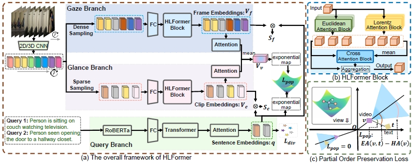

# HLFormer: Enhancing Partially Relevant Video Retrieval with Hyperbolic Learning

[](https://arxiv.org/abs/2507.17402) [](https://huggingface.co/papers/2507.17402) [](https://mp.weixin.qq.com/s/2hXBIRuNTpFKgJttNQqiKA) 

:star: If HLFormer is helpful to your   projects, please help star this repo. Thanks! :hugs:
## TABLE OF CONTENTS
- [HLFormer: Enhancing Partially Relevant Video Retrieval with Hyperbolic Learning](#hlformer-enhancing-partially-relevant-video-retrieval-with-hyperbolic-learning)
  - [TABLE OF CONTENTS](#table-of-contents)
  - [1. Introduction](#1-introduction)
  - [2. Preparation](#2-preparation)
    - [2.1 Requirements](#21-requirements)
    - [2.2 Download the  feature datasets and organize them properly](#22-download-the--feature-datasets-and-organize-them-properly)
  - [3. Run](#3-run)
    - [3.1 Train](#31-train)
    - [3.2 Retrieval Performance](#32-retrieval-performance)
  - [4. References](#4-references)
  - [5. Acknowledgements](#5-acknowledgements)
  - [6. Contact](#6-contact)

## 1. Introduction
This repository contains the **PyTorch** implementation of our work at **ICCV 2025**.:

> [**Enhancing Partially Relevant Video Retrieval with Hyperbolic Learning**](http://arxiv.org/abs/2507.17402) [Jun Li](https://github.com/lijun2005/), [Jinpeng Wang](https://github.com/gimpong), Chaolei Tan, Niu Lian, Long Chen, Yaowei Wang, Min Zhang,  Shu-Tao Xia, Bin Chen.



We propose **HLFormer**, the *first* hyperbolic modeling framework for PRVR, which leverages hyperbolic space learning to compensate for the suboptimal hierarchical modeling capabilities of Euclidean space. HLFormer's designs are faithfully tailored for two core demands in PRVR, namely (**i**) temporal modeling to extract key moment features, and  (**ii**) learning robust cross-modal representations. 
For (i), we inject the **intra-video hierarchy prior** into the temporal modeling by introducing multi-scale Lorentz attention. 
It collaborates with the Euclidean attention and enhances activation of discriminative moment features relevant to queries. 
For (ii), we introduce $L_{pop}$ to impose a fine-grained 'text < video' semantic entailment constraint in hyperbolic space. This helps to model the **inter-video hierarchy prior** among videos and texts. 

Besides, we invite readers to refer to our previous work [GMMFormer](https://github.com/huangmozhi9527/GMMFormer) and [GMMFormerV2](https://github.com/huangmozhi9527/GMMFormer_v2).

In the following, we will guide you how to use this repository step by step. 🤗🐶

## 2. Preparation

```bash
git clone https://github.com/lijun2005/ICCV25-HLFormer.git
cd ICCV25-HLFormer/
```

### 2.1 Requirements

- python==3.11.8
- numpy==1.26.4
- pytorch==2.0.1
- torchvision==0.15.2
- scipy==1.12.0
- h5py==3.10.0
- addict==2.4.0
- `pip install -r requirements.txt`

### 2.2 Download the  feature datasets and organize them properly
All features of TVR, ActivityNet Captions and Charades-STA are kindly provided by the authors of [ms-sl](https://github.com/HuiGuanLab/ms-sl).

**!!! Please note that we did not use any features derived from ViT.**

The data can be downloaded from [Baidu pan](https://pan.baidu.com/s/1UNu67hXCbA6ZRnFVPVyJOA?pwd=8bh4) or [Google drive](https://drive.google.com/drive/folders/11dRUeXmsWU25VMVmeuHc9nffzmZhPJEj?usp=sharing). 

The dataset directory is organized as follows:

```bash
PRVR_data/
└── PRVR/
    ├── activitynet/
    │   ├── FeatureData/
    │   ├── TextData/
    │   ├── val_1.json
    │   └── val_2.json
    ├── charades/
    │   ├── FeatureData/
    │   └── TextData/
    └── tvr/
        ├── FeatureData/
        └── TextData/
```
Finally, set root and data_root in config files (*e.g.*, ./src/Configs/tvr.py `cfg['root']` and `cfg['data_root']`).

## 3. Run
### 3.1 Train 
To train HLFormer on TVR:
```
cd src
python main.py -d tvr --gpu 0
```

To train HLFormer on ActivityNet Captions:
```
cd src
python main.py -d act --gpu 0
```

To train HLFormer on Charades-STA:
```
cd src
python main.py -d cha --gpu 0
```

### 3.2 Retrieval Performance

For this repository, the expected performance is:

| *Dataset* | *R@1* | *R@5* | *R@10* | *R@100* | *SumR* | *ckpt and logs* |
| ---- | ---- | ---- | ---- | ---- | ---- |---- |
| TVR | 15.7 | 37.1 | 48.5 | 86.4 | 187.7 |[Google drive](https://drive.google.com/file/d/1NIl0x90qbdGxn9rwqVqS8MRpIdzKdPr1/view?usp=sharing) |
| ActivityNet Captions | 8.7 | 27.1 | 40.1 | 79.0 | 154.9 |[Google drive](https://drive.google.com/file/d/1B3mxKkUxtfNEggiJSwExFCV0gEbuZSzf/view?usp=sharing) |
| Charades-STA | 2.6 | 8.5 | 13.7 | 54.0 | 78.7 |[Google drive](https://drive.google.com/file/d/1rwM7c63hGFWFENfWDOdnu-Pitzy9NOZJ/view?usp=sharing) |


## 4. References
If you find our code useful or use the toolkit in your work, please consider citing:
```
@inproceedings{Li25_HLFormer,
  author = {Li, Jun and  Wang, Jinpeng and Tan, Chaolei and Lian,Niu and Chen,Long and Wang, Yaowei and Zhang,Min and Xia, Shu-Tao and Chen, Bin},
  title={Enhancing Partially Relevant Video Retrieval with Hyperbolic Learning},
  booktitle={Proceedings of the IEEE/CVF International Conference on Computer Vision},
  year={2025}
}
```
## 5. Acknowledgements
This code is based on our previous work [GMMFormer](https://github.com/huangmozhi9527/GMMFormer) and [GMMFormerV2](https://github.com/huangmozhi9527/GMMFormer_v2).
We are also grateful for other teams for open-sourcing codes that inspire our work, including 
[ms-sl](https://github.com/HuiGuanLab/ms-sl),
[dl-dkd](https://github.com/HuiGuanLab/DL-DKD), 
[meru](https://github.com/facebookresearch/meru).
## 6. Contact
If you have any question, you can raise an issue or email Jun Li (220110924@stu.hit.edu.cn) and Jinpeng Wang (wjp20@mails.tsinghua.edu.cn).


